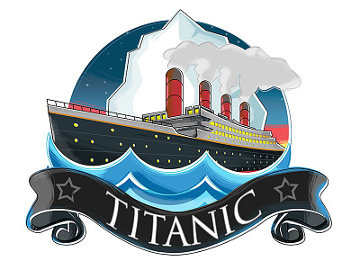

<!-- TITLE PROJECT -->

<h2 align="center">TITANIC DATA ANALYST</h2>

<!-- PROJECT LOGO -->
 

  

 

<!-- ABOUT THE PROJECT -->
## About The Project

In this new analysis of the Titanic dataset, changes and improvements have been made for the reader's compression and study.
This project started a few months ago and now a more detailed analysis is completed and with new improvements for its understanding.

## News:

* New Streamlit app
* New EDA Analyst
* New Jupiter
* Add Power Bi Pannel
* Add Regression Model : RandomForest

<!-- TOOLS -->

## Tools used in this exploratory analysis:

* []
* []
* []
* []
* []
* []

  ## Contact:

  []  https://www.linkedin.com/in/andrés-rojo-cabrera-047ba2124/
  
  Project Link: https://github.com/andyrouge81/Titanic-DataFrame/tree/main
  
